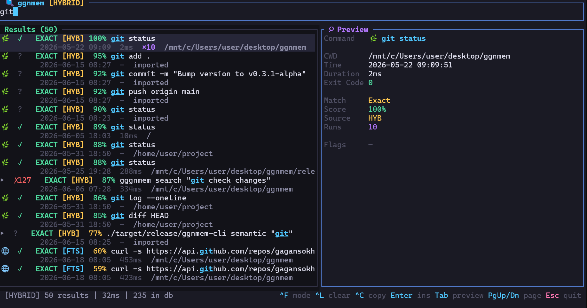
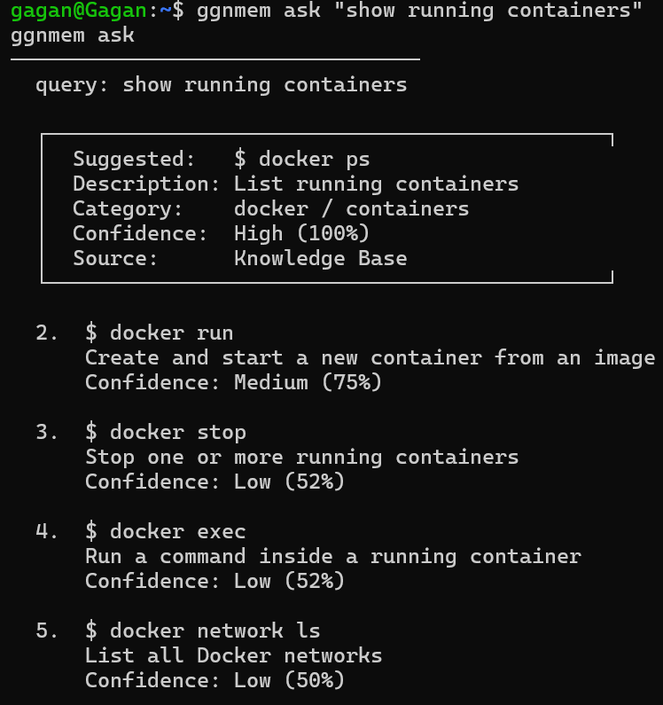
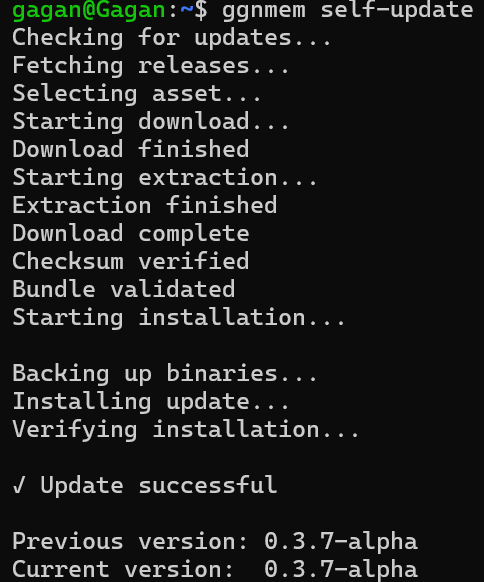

<div align="center">

# ggnmem

**The Semantic Terminal Memory Engine: Your shell history, understood—not just stored.**

[](https://github.com/gagansokhal-coder/Terminal_helper/actions/workflows/ci.yml)
[](https://github.com/gagansokhal-coder/Terminal_helper/releases)
[](LICENSE)

</div>

---

## Why ggnmem?

**The Problem with Traditional History**  
Every developer has spent hours crafting the perfect multi-flag command—only to forget it weeks later. Traditional shell history is just a flat, literal log. When you press `Ctrl+R`, it searches for keystrokes, not intent. If you can't remember the exact syntax you used to extract a tarball or query a database, your shell history can't help you. 

**The Semantic Solution**  
ggnmem replaces your "dumb" history file with an intelligent, searchable memory engine. By running silently in the background, it captures every command and uses AI to generate vector embeddings. This means you can search your history by meaning instead of memorization. If you type "check git changes," ggnmem knows you're looking for `git status` or `git diff`. It fuses blazing-fast keyword search with local AI embeddings to deliver exactly what you meant to find.

**Local-First and Private**  
Your terminal history contains highly sensitive data, from server addresses to project names and secret tokens. We believe that intelligence shouldn't require compromising your privacy. That's why ggnmem is built on a strict local-first architecture. All AI inference runs directly on your CPU using lightweight, offline models. There are no API keys, no subscriptions, and no telemetry. Your data never leaves your machine.

---

## Features

*   **Never forget commands:** Automatically capture and index every shell operation in < 10ms.
*   **Search by meaning:** Find commands using natural language, not just exact syntax.
*   **AI-powered recall:** Leverage lightweight ONNX models (MiniLM, BGE) for intelligent intent matching.
*   **Hybrid Search Engine:** Combines FTS5 keyword matching with Semantic intent matching via Reciprocal Rank Fusion.
*   **Interactive TUI:** A full-screen `Ctrl+R` replacement with mode cycling and command previews.
*   **History Import:** Instantly ingest and deduplicate existing Bash, Zsh, and Fish history.
*   **Local and private:** Zero cloud dependencies. No telemetry, no API calls, complete privacy.
*   **Works offline:** Fully functional on air-gapped systems after the initial model setup.
*   **One-line installer:** Zero-friction setup with an automatic bootstrap script.
*   **Self-Updating:** Painless in-place upgrades.

---

## Quick Install

```bash
curl -fsSL https://raw.githubusercontent.com/gagansokhal-coder/Terminal_helper/main/scripts/install-online.sh | bash
```

*This bootstrap script detects your architecture, installs the latest pre-built binaries, and configures your shell hooks automatically.*

For manual installations or WSL details, see [INSTALL.md](INSTALL.md).

---

## Quick Start

### 1. Verify Installation

```bash
ggnmem version
ggnmem doctor
```

### 2. Start Daemon

```bash
ggnmem start
ggnmem status
```

### 3. Import Existing History

```bash
ggnmem import auto
```

---

## Example Usage

### Interactive Terminal Search

Search thousands of previous commands instantly using
keyword, semantic, or hybrid ranking.



### Natural Language Search

Ask for commands in plain English.

```bash
ggnmem ask "show running containers"
```



---

## Architecture

```text
Shell
  ↓
Capture Hook
  ↓
Daemon
  ↓
SQLite + FTS5 + Vectors
  ↓
Search / Semantic Search / AI
```

---

## AI Features

ggnmem's semantic search uses vector embeddings to understand the *intent* behind your commands.

*   **Local Embeddings:** Uses lightweight [ONNX Runtime](https://onnxruntime.ai/) models (MiniLM-L6-v2 or BGE-Small-EN).
*   **Zero Cloud:** Inference runs 100% locally on your CPU. No API keys, no data harvesting.
*   **Setup Wizard:** Simply run `ggnmem ai setup` to download the model (~30MB) and start semantic indexing.

---

## Self Updating

Keep ggnmem up to date with a single command.

```bash
ggnmem self-update
```



This command automatically checks for new releases, verifies checksums, swaps binaries, and restarts the daemon while preserving your existing database and configuration.

---

## Privacy

Built on a strict **local-first philosophy**:
*   **Zero network requests** after initial model/update downloads.
*   **No accounts or telemetry.**
*   **Secret redaction:** Automatically scrubs detected API keys and passwords before storage.
*   **Secure:** Sockets and database files are restricted strictly to your user.

---

## Roadmap

**Current Status:** Linux MVP complete with full shell capture, hybrid search, interactive TUI, and AI embeddings.

**Phase 26+ Focus:**
*   Windows PowerShell native support
*   Ghost-text autosuggestions
*   Fish and Nushell hook integrations
*   Enhanced custom indexing plugins

See [docs/roadmap.md](docs/roadmap.md) for full details.

---

## License

This project is licensed under the [MIT License](LICENSE).

```
MIT License — Copyright (c) 2026 ggnmem contributors
```
