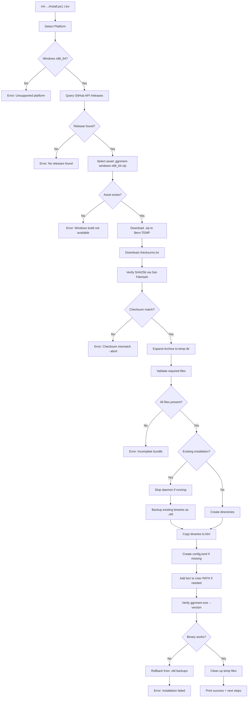
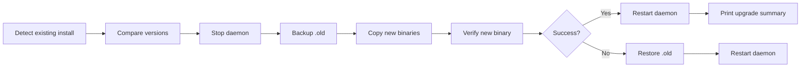
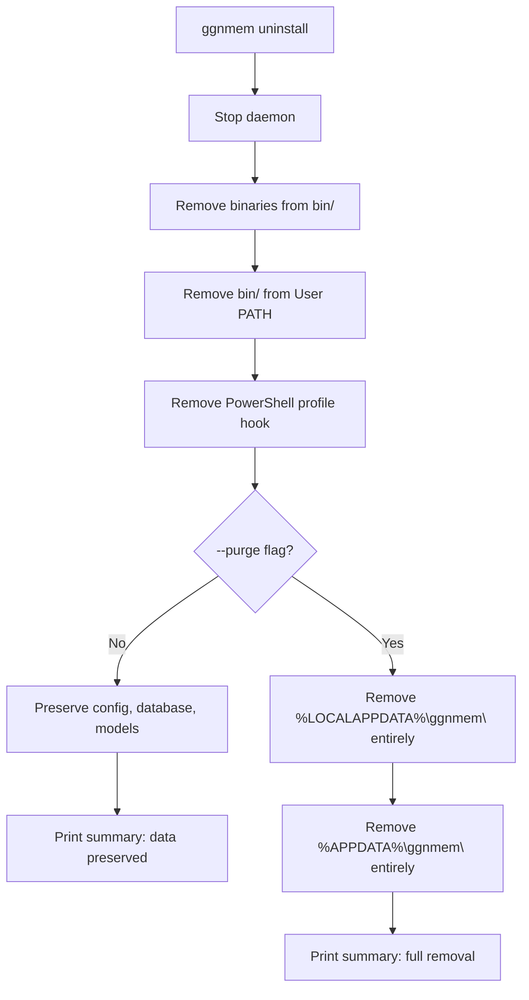

# Phase 26 — Windows Native Installer

> Engineering Design Document  
> Status: **Approved — Design Review Applied**  
> Author: Phase 26 design review  
> Date: 2026-06-20  
> Target Version: **v0.4.0-alpha**

---

## 1. Problem Statement

ggnmem currently supports installation only on **Linux** and **WSL** via:

- `install.sh` — offline installer bundled in release tarballs
- `scripts/install-online.sh` — one-line `curl | bash` bootstrap
- `ggnmem self-update` — in-place binary upgrade (Linux-only, uses `/tmp`, `tar`, `HOME`)

All three paths assume a POSIX environment: Bash, `tar`, `sha256sum`, Unix paths, and `$HOME/.local/bin`. None work on native Windows.

**Goal:** Enable `ggnmem` to be installed, upgraded, and uninstalled natively on Windows 10/11 without requiring WSL.

**Target experience:**

```powershell
irm https://ggnmem.mytechy.in/install.ps1 | iex
```

---

## 2. Current Architecture Audit

### 2.1 Existing Windows Support in Codebase

The Rust codebase already has **partial Windows PAL support**:

| Component | Windows Status | Details |
|-----------|---------------|---------|
| `ggnmem-daemon` platform module | ✅ Implemented | `platform/windows/mod.rs` — Named Pipe IPC via `tokio::net::windows::named_pipe` |
| `IpcEndpoint::NamedPipe` | ✅ Implemented | `\\.\pipe\ggnmem_ipc` default endpoint |
| `DaemonConfig` Windows paths | ⚠️ Needs update | Currently uses `%APPDATA%\ggnmem\` for database — must move to `%LOCALAPPDATA%\ggnmem\data\` |
| `get_platform_info()` in `update.rs` | ⚠️ Partial | Detects `windows-x86_64` but `select_asset()` filters for `.tar.gz` only |
| `perform_install()` in `update.rs` | ❌ Linux-only | Hardcodes `$HOME/.local/bin`, uses `tar` command, Unix permissions |
| `get_download_dir()` | ❌ Linux-only | Returns `/tmp/ggnmem-update` |
| Release workflow (`release.yml`) | ❌ Linux-only | Only builds `x86_64-unknown-linux-gnu` and `aarch64-unknown-linux-gnu` |
| Release asset naming | ❌ Linux-only | Only produces `ggnmem-linux-{arch}.tar.gz` |
| Shell hooks | ❌ Linux-only | Only Bash/Zsh `preexec`/`precmd` hooks |

### 2.2 Key Differences: Linux vs Windows Installation

| Concern | Linux (current) | Windows (proposed) |
|---------|----------------|-------------------|
| Binary location | `~/.local/bin/` | `%LOCALAPPDATA%\ggnmem\bin\` |
| Config location | `~/.config/ggnmem/` | `%APPDATA%\ggnmem\` |
| Data location | `~/.local/share/ggnmem/` | `%LOCALAPPDATA%\ggnmem\data\` |
| AI Models | `~/.local/share/ggnmem/models/` | `%LOCALAPPDATA%\ggnmem\models\` |
| State/logs | `~/.local/state/ggnmem/` | `%LOCALAPPDATA%\ggnmem\logs\` |
| Archive format | `.tar.gz` | `.zip` |
| Checksum tool | `sha256sum` | `Get-FileHash` (built-in) |
| PATH modification | Append to `~/.bashrc`/`~/.zshrc` | Modify User `PATH` environment variable |
| IPC mechanism | Unix Domain Socket | Named Pipe (`\\.\pipe\ggnmem_ipc`) |
| Daemon management | `pgrep`/`kill` | `Get-Process`/`Stop-Process` |
| Shell integration | Bash/Zsh hooks | PowerShell profile hooks |
| Installer language | Bash | PowerShell |

---

## 3. Architecture

### 3.1 Component Overview

```
┌─────────────────────────────────────────────────────────┐
│                  Windows Installation                    │
├─────────────────────────────────────────────────────────┤
│                                                         │
│  ┌───────────────┐    ┌──────────────┐                  │
│  │  install.ps1  │───▶│ GitHub API   │                  │
│  │  (bootstrap)  │    │ /releases    │                  │
│  └───────┬───────┘    └──────┬───────┘                  │
│          │                   │                          │
│          │          ┌────────▼────────┐                  │
│          │          │ Download .zip + │                  │
│          │          │ checksums.txt   │                  │
│          │          └────────┬────────┘                  │
│          │                   │                          │
│          │          ┌────────▼────────┐                  │
│          │          │ SHA256 verify   │                  │
│          │          │ (Get-FileHash)  │                  │
│          │          └────────┬────────┘                  │
│          │                   │                          │
│          │          ┌────────▼────────┐                  │
│          │          │ Extract .zip    │                  │
│          │          │ (Expand-Archive)│                  │
│          │          └────────┬────────┘                  │
│          │                   │                          │
│          ▼                   ▼                          │
│  ┌────────────────────────────────────┐                  │
│  │        Install Logic               │                  │
│  │                                    │                  │
│  │  1. Stop daemon (if running)       │                  │
│  │  2. Backup existing binaries       │                  │
│  │  3. Copy to %LOCALAPPDATA%\ggnmem  │                  │
│  │  4. Create default config.toml     │                  │
│  │  5. Add to User PATH              │                  │
│  │  6. Verify binaries                │                  │
│  │  7. Restart daemon                 │                  │
│  └────────────────────────────────────┘                  │
│                                                         │
└─────────────────────────────────────────────────────────┘
```

### 3.2 Directory Layout on Windows

```
%LOCALAPPDATA%\ggnmem\
├── bin\
│   ├── ggnmem.exe              # CLI binary
│   ├── ggnmem-daemon.exe       # Background daemon
│   ├── ggnmem.exe.old          # Rollback backup (during upgrades)
│   └── ggnmem-daemon.exe.old   # Rollback backup (during upgrades)
├── data\
│   └── ggnmem.db               # Command history database
├── models\
│   └── all-MiniLM-L6-v2\       # AI embedding models
├── logs\
│   └── daemon.log
└── VERSION                     # Installed version metadata

%APPDATA%\ggnmem\
└── config.toml                 # User configuration (roaming-safe)
```

**Rationale:**

- `%LOCALAPPDATA%` (`C:\Users\<user>\AppData\Local\`) for machine-local data:
  - **Binaries** — must not roam with profiles
  - **Database** — can grow significantly; should not roam with Windows roaming profiles
  - **AI Models** — large files (~30-50 MB each); should not roam
  - **Logs** — machine-specific runtime data
- `%APPDATA%` (`C:\Users\<user>\AppData\Roaming\`) for configuration only:
  - **config.toml** — small, user preferences, safe to roam across machines
- This follows standard Windows application storage conventions where large, machine-specific data belongs in `LOCALAPPDATA`

> **⚠️ Breaking change from initial draft:** The database was previously planned for `%APPDATA%\ggnmem\ggnmem.db`. It has been moved to `%LOCALAPPDATA%\ggnmem\data\ggnmem.db` because databases should not roam with Windows roaming profiles. The `config.rs` `default_database_path()` function must be updated accordingly.

### 3.3 Installer Flow Diagram



---

## 4. PowerShell Bootstrap Installer (`install.ps1`)

### 4.1 Design Principles

1. **Zero external dependencies** — use only built-in PowerShell cmdlets
2. **Compatible with PowerShell 5.1+** (ships with Windows 10) and PowerShell 7+
3. **Non-interactive by default** — no prompts during `irm | iex` usage
4. **Idempotent** — safe to run multiple times (acts as upgrade on re-run)
5. **Atomic-with-rollback** — backup old binaries, restore on failure
6. **Checksum verification mandatory** — SHA256 via `Get-FileHash`
7. **No elevation required** — user-level installation only

### 4.2 PowerShell 5 vs 7 Compatibility

| Feature | PS 5.1 | PS 7+ | Approach |
|---------|--------|-------|----------|
| `Invoke-RestMethod` | ✅ | ✅ | Use for GitHub API calls |
| `Invoke-WebRequest` | ✅ | ✅ | Use for binary downloads |
| `Get-FileHash` | ✅ | ✅ | Built-in SHA256 verification |
| `Expand-Archive` | ✅ | ✅ | Built-in ZIP extraction |
| `ConvertFrom-Json` | ✅ | ✅ | Parse GitHub API response |
| `$env:LOCALAPPDATA` | ✅ | ✅ | Standard environment variable |
| TLS 1.2 | ⚠️ Must set | ✅ Default | Force `[Net.ServicePointManager]::SecurityProtocol` on PS 5 |

**Critical PS 5 consideration:** TLS 1.2 must be explicitly enabled before HTTPS calls:

```powershell
[Net.ServicePointManager]::SecurityProtocol = [Net.SecurityProtocolType]::Tls12
```

### 4.3 Installer Source Strategy

**Single source of truth:** The canonical `install.ps1` lives in the repository at the project root. The website (`ggnmem.mytechy.in/install.ps1`) serves this file directly from the repository source — either via a Vercel rewrite rule proxying to the raw GitHub URL, or via a redirect. No duplicated copies are maintained.

| URL | Source | Mechanism |
|-----|--------|-----------|
| `https://ggnmem.mytechy.in/install.ps1` | Public user-facing URL | Vercel rewrite → raw GitHub |
| `https://raw.githubusercontent.com/gagansokhal-coder/Terminal_helper/main/install.ps1` | Canonical source | Direct from repo |

This ensures:
- Only one `install.ps1` is ever edited
- Website and repository installer are always identical
- No sync issues between multiple copies

### 4.4 Installer Script Structure

```
install.ps1 (canonical source: repo root)
├── Platform detection (OS, architecture, PS version)
├── GitHub API query (latest release)
├── Asset selection (ggnmem-windows-x86_64.zip)
├── Download to $env:TEMP\ggnmem-installer\
├── Checksum verification (Get-FileHash)
├── Extraction (Expand-Archive)
├── Bundle validation (required files check)
├── Existing installation detection
│   ├── Stop running daemon
│   └── Backup binaries (.old)
├── File installation (%LOCALAPPDATA%\ggnmem\bin\)
├── Data directory creation (%LOCALAPPDATA%\ggnmem\data\)
├── Config creation (%APPDATA%\ggnmem\config.toml)
├── PATH modification (User environment variable)
├── Binary verification (ggnmem.exe version)
├── Rollback on failure
├── Cleanup temp files
└── Success summary with next steps
```

### 4.5 PATH Configuration Strategy

**Approach: User-level PATH modification (no admin required)**

```powershell
$binDir = "$env:LOCALAPPDATA\ggnmem\bin"
$currentPath = [Environment]::GetEnvironmentVariable("Path", "User")

if ($currentPath -notlike "*$binDir*") {
    [Environment]::SetEnvironmentVariable(
        "Path",
        "$currentPath;$binDir",
        "User"
    )
}
```

**Why User PATH, not System PATH:**

- No UAC elevation prompt needed
- Respects least-privilege principle
- Survives Windows upgrades
- Consistent with other user-installed tools (Rust/Cargo, Node/npm, Python/pip)
- Uninstall is clean — remove the single entry

**Important caveat:** The PATH change does NOT take effect in the current PowerShell session. The installer must also set `$env:Path` for the current session:

```powershell
$env:Path = "$binDir;$env:Path"
```

And instruct the user to open a new terminal for permanent effect.

---

## 5. Native Windows Binary Packaging

### 5.1 Build Targets

| Target Triple | Architecture | Priority |
|--------------|-------------|----------|
| `x86_64-pc-windows-msvc` | x86_64 | **P0 — Required** |
| `aarch64-pc-windows-msvc` | ARM64 | P1 — Future (Windows on ARM) |

**MSVC vs GNU:** The MSVC target is strongly preferred because:
- It's the native Windows ABI
- Produces smaller binaries
- Better compatibility with Windows APIs (Named Pipes, process management)
- Avoids shipping MinGW runtime DLLs

### 5.2 Build Configuration

The GitHub Actions release workflow needs a new matrix entry:

```yaml
matrix:
  include:
    # ... existing Linux entries ...
    - target: x86_64-pc-windows-msvc
      arch: x86_64
      os: windows-latest
      platform: windows
```

**Windows-specific build requirements:**
- `windows-latest` runner (provides MSVC toolchain)
- No cross-compilation needed (native build)
- Binary names must include `.exe` extension
- Strip debug symbols: not needed on Windows (PDB files are separate)

### 5.3 Release Asset Naming Convention

Current naming scheme:
```
ggnmem-linux-x86_64.tar.gz
ggnmem-linux-aarch64.tar.gz
checksums.txt
```

**Proposed expanded naming:**
```
ggnmem-linux-x86_64.tar.gz          # Existing
ggnmem-linux-aarch64.tar.gz         # Existing
ggnmem-windows-x86_64.zip           # NEW
checksums.txt                        # Updated to include Windows asset
```

**Archive format: ZIP** (not `.tar.gz`)
- ZIP is natively supported by Windows (`Expand-Archive`)
- No need for `tar` or third-party extraction tools
- Standard Windows packaging format

### 5.4 ZIP Bundle Contents

```
ggnmem-windows-x86_64.zip
├── ggnmem.exe              # CLI binary (renamed from ggnmem-cli.exe)
├── ggnmem-daemon.exe       # Daemon binary
├── install.ps1             # PowerShell installer
├── README.md               # Quick-start docs
├── VERSION                 # Build metadata
└── checksums.txt           # SHA256 hashes of files in bundle
```

### 5.5 Assembly Script for Windows

A new `scripts/assemble_release_windows.sh` (runs in CI on the Windows runner via Git Bash or PowerShell) will:

1. Copy and rename `target/x86_64-pc-windows-msvc/release/ggnmem-cli.exe` → `ggnmem.exe`
2. Copy `target/x86_64-pc-windows-msvc/release/ggnmem-daemon.exe`
3. Copy `install.ps1`, `README.md`
4. Generate `VERSION` and `checksums.txt`
5. Create ZIP archive via `Compress-Archive` or `7z`

---

## 6. Upgrade Strategy

### 6.1 Upgrade Paths

| Method | Command | Description |
|--------|---------|-------------|
| **Re-run installer** | `irm .../install.ps1 \| iex` | Full online upgrade, safe for any version delta |
| **Self-update** | `ggnmem self-update` | Binary self-replacement (requires Rust changes) |
| **Manual** | Download ZIP, run `install.ps1` | Offline upgrade from downloaded bundle |

### 6.2 Upgrade Flow (Re-run Installer)



### 6.3 Self-Update for Windows

The existing `update.rs` needs these modifications for Windows:

| Current (Linux) | Required (Windows) |
|-----|-----|
| `get_download_dir()` returns `/tmp/ggnmem-update` | Return `$env:TEMP\ggnmem-update` |
| `select_asset()` filters `.tar.gz` | Also match `.zip` on Windows |
| `extract_tar_gz()` shells out to `tar` | Use `Expand-Archive` or Rust ZIP crate |
| `perform_install()` uses `$HOME/.local/bin` | Use `%LOCALAPPDATA%\ggnmem\bin` |
| `validate_extracted_bundle()` checks for `install.sh` | Check for `install.ps1` on Windows |
| Unix file permissions (`chmod 0o755`) | No-op on Windows (already executable) |
| `run_silent_cmd()` for daemon stop/start | Works cross-platform (uses `current_exe()`) |

### 6.4 What Gets Preserved During Upgrade

| Data | Path | Preserved? |
|------|------|-----------|
| Configuration | `%APPDATA%\ggnmem\config.toml` | ✅ Never overwritten |
| Database | `%LOCALAPPDATA%\ggnmem\data\ggnmem.db` | ✅ Never touched |
| AI Models | `%LOCALAPPDATA%\ggnmem\models\` | ✅ Never touched |
| Binaries | `%LOCALAPPDATA%\ggnmem\bin\` | 🔄 Replaced (old backed up) |

---

## 7. Rollback Strategy

### 7.1 During Installation/Upgrade

The installer maintains `.old` backup files:

```
%LOCALAPPDATA%\ggnmem\bin\
├── ggnmem.exe              # New version
├── ggnmem.exe.old          # Previous version (backup)
├── ggnmem-daemon.exe       # New version
└── ggnmem-daemon.exe.old   # Previous version (backup)
```

**Rollback trigger:** If `ggnmem.exe --version` fails after copying new binaries:

1. Delete new `ggnmem.exe` and `ggnmem-daemon.exe`
2. Rename `.old` files back to the original names
3. Restart daemon with the restored binaries
4. Report error to user

### 7.2 Manual Rollback

If a user discovers issues after installation:

```powershell
# Rollback to previous version
$binDir = "$env:LOCALAPPDATA\ggnmem\bin"
ggnmem stop

Rename-Item "$binDir\ggnmem.exe" "$binDir\ggnmem.exe.bad"
Rename-Item "$binDir\ggnmem.exe.old" "$binDir\ggnmem.exe"

Rename-Item "$binDir\ggnmem-daemon.exe" "$binDir\ggnmem-daemon.exe.bad"
Rename-Item "$binDir\ggnmem-daemon.exe.old" "$binDir\ggnmem-daemon.exe"

ggnmem start
ggnmem version
```

### 7.3 Rollback Limitations

- Only **one previous version** is retained (`.old`)
- Rolling back across multiple versions requires re-downloading the specific release
- Database schema migrations are **not** rolled back (forward-only migrations)
- Config file changes from new versions are not reverted (config is never overwritten)

---

## 8. Checksum Verification

### 8.1 Verification Chain

```
GitHub Release
├── ggnmem-windows-x86_64.zip    ◄── SHA256 hash in checksums.txt
├── ggnmem-linux-x86_64.tar.gz   ◄── SHA256 hash in checksums.txt
├── ggnmem-linux-aarch64.tar.gz  ◄── SHA256 hash in checksums.txt
└── checksums.txt                 ◄── Downloaded separately, verified against bundle
```

**Inside the ZIP bundle:**

```
checksums.txt (bundle-level)
├── ggnmem.exe          ◄── SHA256 hash
├── ggnmem-daemon.exe   ◄── SHA256 hash
├── install.ps1         ◄── SHA256 hash
├── README.md           ◄── SHA256 hash
└── VERSION             ◄── SHA256 hash
```

### 8.2 PowerShell Verification Implementation

```powershell
# Download-level verification
$expectedHash = (Get-Content checksums.txt |
    Where-Object { $_ -match 'ggnmem-windows-x86_64.zip' }) -split '\s+' | Select-Object -First 1

$actualHash = (Get-FileHash -Path $zipPath -Algorithm SHA256).Hash.ToLower()

if ($expectedHash -ne $actualHash) {
    Write-Error "Checksum mismatch! Downloaded file may be corrupt or tampered."
    Remove-Item $zipPath
    exit 1
}
```

### 8.3 Checksum Generation in CI

The `checksums.txt` in the release job must include the Windows asset:

```bash
cd dist
sha256sum *.tar.gz *.zip > checksums.txt
```

---

## 9. Security Considerations

### 9.1 Transport Security

| Concern | Mitigation |
|---------|-----------|
| Download tampering (MITM) | HTTPS-only downloads from `api.github.com` and `github.com` |
| TLS downgrade (PS 5) | Explicitly force TLS 1.2: `[Net.ServicePointManager]::SecurityProtocol = [Net.SecurityProtocolType]::Tls12` |
| GitHub API spoofing | Pin the repo owner/name `gagansokhal-coder/Terminal_helper` in the script |
| DNS hijacking | SHA256 checksum verification as secondary guarantee |

### 9.2 Installation Security

| Concern | Mitigation |
|---------|-----------|
| PATH injection | Install to `%LOCALAPPDATA%` (user-writable, not world-writable) |
| Binary replacement by other processes | `%LOCALAPPDATA%` has user-only ACLs by default |
| UAC bypass attempts | Installer never requests elevation; fails gracefully if paths require admin |
| Running arbitrary code via `irm \| iex` | Script is hosted in the public GitHub repo — fully auditable. Pinned to `main` branch. |
| Antivirus false positives | Windows binaries built with MSVC. Consider code-signing in future (see §9.4). |

### 9.3 Runtime Security

| Concern | Mitigation |
|---------|-----------|
| Named Pipe security | Default pipe name `\\.\pipe\ggnmem_ipc` — Windows restricts pipe access by default to the creating user |
| Database file permissions | `%LOCALAPPDATA%` is user-only by default Windows ACLs |
| Config file secrets | `config.toml` stored in user-only directory |
| No network calls at runtime | Same guarantee as Linux — zero telemetry, zero phone-home |

### 9.4 Future: Code Signing

For production releases, Windows binaries should be **Authenticode signed** to:
- Prevent SmartScreen "unknown publisher" warnings
- Avoid antivirus false positives
- Build user trust

**Requirements:**
- Extended Validation (EV) or Organization Validation (OV) code-signing certificate
- Integration with CI via `signtool.exe` or Azure Trusted Signing
- Cost: ~$200-400/year (OV) or ~$300-500/year (EV)

**This is deferred to a future phase** — not required for the initial Windows installer.

---

## 10. Future `winget` Support

### 10.1 What is `winget`?

`winget` (Windows Package Manager) is Microsoft's official CLI package manager, shipping with Windows 11 and available for Windows 10. It enables:

```powershell
winget install ggnmem
winget upgrade ggnmem
winget uninstall ggnmem
```

### 10.2 Requirements for `winget` Submission

| Requirement | Status | Notes |
|-------------|--------|-------|
| Public GitHub release with downloadable installer/binary | ✅ Will have | ZIP bundle on GitHub Releases |
| Package manifest (YAML) | ❌ Needs creation | Submitted to `microsoft/winget-pkgs` repo |
| Stable versioning | ⚠️ Pre-release | `winget` prefers stable versions but accepts pre-release |
| Installer type support | ✅ Supported | `winget` supports `.zip` bundles with portable mode |
| SHA256 hash | ✅ Will have | Required in manifest |
| License | ✅ MIT | Already defined |

### 10.3 `winget` Manifest Structure

```yaml
# manifests/g/gagansokhal-coder/ggnmem/0.4.0-alpha/
PackageIdentifier: gagansokhal-coder.ggnmem
PackageVersion: 0.4.0-alpha
PackageName: ggnmem
Publisher: gagansokhal-coder
License: MIT
ShortDescription: Semantic Terminal Memory Engine
PackageUrl: https://ggnmem.mytechy.in
Installers:
  - Architecture: x64
    InstallerType: zip
    InstallerUrl: https://github.com/gagansokhal-coder/Terminal_helper/releases/download/v0.4.0-alpha/ggnmem-windows-x86_64.zip
    InstallerSha256: <sha256>
    NestedInstallerType: portable
    NestedInstallerFiles:
      - RelativeFilePath: ggnmem.exe
        PortableCommandAlias: ggnmem
      - RelativeFilePath: ggnmem-daemon.exe
        PortableCommandAlias: ggnmem-daemon
ManifestType: singleton
ManifestVersion: 1.6.0
```

### 10.4 `winget` Automation

After Phase 26 stabilizes, a GitHub Action can automatically submit `winget` manifest PRs to `microsoft/winget-pkgs` on each release using:
- [winget-create](https://github.com/microsoft/winget-create)
- or [vedantmgoyal9/winget-releaser](https://github.com/vedantmgoyal9/winget-releaser)

### 10.5 `winget` Timeline

| Milestone | Dependency |
|-----------|-----------|
| Phase 26 complete + Windows binary on GitHub Releases | This phase |
| First manual `winget` manifest submission | After Phase 26 |
| Automated `winget` manifest updates via CI | After first manual submission accepted |

---

## 11. PowerShell Profile Integration

### 11.1 Shell Hook Installation

After installing binaries, the installer should offer to configure PowerShell integration:

```powershell
# Added to $PROFILE (e.g., Microsoft.PowerShell_profile.ps1)
# ggnmem shell integration
Invoke-Expression (& ggnmem init powershell)
# end ggnmem
```

This requires a new `ggnmem init powershell` command in the CLI that outputs the appropriate PowerShell script block for:
- `Set-PSReadLineOption -AddToHistoryHandler` for command capture
- Keybinding registration for Ctrl+R override
- Session metadata capture

### 11.2 Profile Detection

PowerShell profiles have multiple scopes:

| Profile | Path | Scope |
|---------|------|-------|
| Current User, Current Host | `$PROFILE.CurrentUserCurrentHost` | ✅ Recommended |
| Current User, All Hosts | `$PROFILE.CurrentUserAllHosts` | Alternative |
| All Users, Current Host | `$PROFILE.AllUsersCurrentHost` | Requires admin |
| All Users, All Hosts | `$PROFILE.AllUsersAllHosts` | Requires admin |

The installer targets `$PROFILE.CurrentUserCurrentHost` (no admin required). If the profile file does not exist, it is created.

---

## 12. Uninstall Support

### 12.1 Uninstall Methods

| Method | Command | Description |
|--------|---------|-------------|
| **CLI uninstall** | `ggnmem uninstall` | Standard uninstall — removes binaries, PATH entry, shell hooks; preserves user data |
| **CLI purge** | `ggnmem uninstall --purge` | Full removal — removes everything including database, models, and config |
| **Script uninstall** | `uninstall.ps1` | Standalone script bundled in ZIP for uninstalling without a working `ggnmem` binary |

### 12.2 Uninstall Flow



### 12.3 What Gets Removed

| Component | `ggnmem uninstall` | `ggnmem uninstall --purge` |
|-----------|-------------------|---------------------------|
| `%LOCALAPPDATA%\ggnmem\bin\ggnmem.exe` | ✅ Removed | ✅ Removed |
| `%LOCALAPPDATA%\ggnmem\bin\ggnmem-daemon.exe` | ✅ Removed | ✅ Removed |
| User PATH entry | ✅ Removed | ✅ Removed |
| PowerShell profile hook | ✅ Removed | ✅ Removed |
| `%APPDATA%\ggnmem\config.toml` | ❌ Kept | ✅ Removed |
| `%LOCALAPPDATA%\ggnmem\data\ggnmem.db` | ❌ Kept | ✅ Removed |
| `%LOCALAPPDATA%\ggnmem\models\` | ❌ Kept | ✅ Removed |
| `%LOCALAPPDATA%\ggnmem\logs\` | ✅ Removed | ✅ Removed |
| `%LOCALAPPDATA%\ggnmem\VERSION` | ✅ Removed | ✅ Removed |

### 12.4 `uninstall.ps1` Script

A standalone `uninstall.ps1` is bundled in the ZIP and optionally installed alongside the binaries. This provides a fallback uninstall mechanism when the `ggnmem` binary itself is broken or missing.

```powershell
# Usage:
# .\uninstall.ps1           # Standard uninstall (preserves data)
# .\uninstall.ps1 -Purge    # Full removal
```

The script performs the same steps as `ggnmem uninstall` but does not depend on the ggnmem binary.

### 12.5 PATH Entry Removal

```powershell
$binDir = "$env:LOCALAPPDATA\ggnmem\bin"
$currentPath = [Environment]::GetEnvironmentVariable("Path", "User")
$newPath = ($currentPath -split ';' | Where-Object { $_ -ne $binDir }) -join ';'
[Environment]::SetEnvironmentVariable("Path", $newPath, "User")
```

---

## 13. Website Integration

### 13.1 Homepage Install Commands

After Phase 26, the website homepage must present both installation paths:

**Linux / WSL:**
```bash
curl -fsSL https://raw.githubusercontent.com/gagansokhal-coder/Terminal_helper/main/scripts/install-online.sh | bash
```

**Windows:**
```powershell
irm https://ggnmem.mytechy.in/install.ps1 | iex
```

The website should automatically display both options, using platform detection or a tabbed interface (Linux | Windows).

### 13.2 Vercel Configuration

Add a rewrite rule to `vercel.json` to serve `install.ps1` from the repository:

```json
{
  "rewrites": [
    {
      "source": "/install.ps1",
      "destination": "https://raw.githubusercontent.com/gagansokhal-coder/Terminal_helper/main/install.ps1"
    }
  ]
}
```

This ensures the user-facing URL `ggnmem.mytechy.in/install.ps1` always serves the canonical script from the repository without maintaining a duplicate copy.

---

## 14. Risk Analysis

### 14.1 Technical Risks

| Risk | Likelihood | Impact | Mitigation |
|------|-----------|--------|-----------|
| **Antivirus quarantines unsigned binary** | Medium | High — blocks installation | Document bypass steps; pursue code signing in future |
| **Windows Defender SmartScreen blocks `irm \| iex`** | Low | Medium — confuses users | Script is not an executable; SmartScreen doesn't block PowerShell scripts run this way |
| **ONNX Runtime fails on Windows** | Low | High — AI features broken | `ort` crate supports Windows; test in CI |
| **Named Pipe IPC issues under restrictive policies** | Low | Medium — daemon won't start | Configurable pipe name via `GGNMEM_NAMED_PIPE` env var |
| **Windows PATH length limit (260 char legacy)** | Very Low | Low | `%LOCALAPPDATA%` paths are short |
| **Cross-compilation failures in CI** | Very Low | Medium | Build natively on `windows-latest` runner |
| **User has restricted PowerShell execution policy** | Medium | High — script won't run | Document `Set-ExecutionPolicy Bypass -Scope Process` workaround in instructions |

### 14.2 User Experience Risks

| Risk | Likelihood | Impact | Mitigation |
|------|-----------|--------|-----------|
| **PATH not updated in current session** | Certain | Medium — "command not found" | Set `$env:Path` in session + clear instructions to open new terminal |
| **Confusion about WSL vs native** | Medium | Low | Clear platform detection messaging in installer |
| **No Ctrl+R shell integration initially** | Certain | Medium | Phase 26 is installer only; shell hooks require separate `ggnmem init powershell` implementation |

---

## 15. Acceptance Criteria

### 15.1 Installer Functionality

- [ ] `irm https://ggnmem.mytechy.in/install.ps1 | iex` downloads and installs `ggnmem.exe` and `ggnmem-daemon.exe` on Windows 10/11
- [ ] Installer works on PowerShell 5.1 (Windows 10 default)
- [ ] Installer works on PowerShell 7+
- [ ] SHA256 checksums are verified before installation
- [ ] Binaries are placed in `%LOCALAPPDATA%\ggnmem\bin\`
- [ ] `%LOCALAPPDATA%\ggnmem\bin` is added to User PATH
- [ ] Default `config.toml` is created in `%APPDATA%\ggnmem\` (if not present)
- [ ] Database directory created at `%LOCALAPPDATA%\ggnmem\data\`
- [ ] `ggnmem version` works after opening a new terminal
- [ ] `ggnmem doctor` works and reports correct Windows paths

### 15.2 Upgrade Functionality

- [ ] Re-running `irm ... | iex` performs in-place upgrade
- [ ] Existing `config.toml` is preserved
- [ ] Existing `ggnmem.db` is preserved in `%LOCALAPPDATA%\ggnmem\data\`
- [ ] Existing AI models are preserved
- [ ] Previous binaries are backed up as `.old`
- [ ] Daemon is stopped before upgrade and restarted after

### 15.3 Uninstall Functionality

- [ ] `ggnmem uninstall` removes binaries, PATH entry, and shell hooks
- [ ] `ggnmem uninstall` preserves config, database, and models
- [ ] `ggnmem uninstall --purge` removes all ggnmem data
- [ ] `uninstall.ps1` works as standalone fallback
- [ ] Uninstall flow is documented

### 15.4 Rollback Functionality

- [ ] If new binary fails verification, old binaries are automatically restored
- [ ] Manual rollback from `.old` files is documented

### 15.5 CI/CD

- [ ] `release.yml` builds `x86_64-pc-windows-msvc` target
- [ ] `ggnmem-windows-x86_64.zip` is published as a GitHub Release asset
- [ ] Windows ZIP asset successfully generated in GitHub Releases
- [ ] `checksums.txt` includes the Windows ZIP hash
- [ ] Binary version in ZIP matches the Git tag

### 15.6 Versioning

- [ ] `v0.4.0-alpha` designated as first Windows milestone release
- [ ] Cargo.toml workspace version bumped to `0.4.0-alpha` for this release

### 15.7 Documentation

- [ ] `INSTALL.md` updated with Windows installation instructions
- [ ] `README.md` updated to show Windows as supported
- [ ] Release notes template updated to include Windows asset
- [ ] Website shows both Linux and Windows install commands

---

## 16. Implementation Phases

> **⚠️ Strict sequencing:** Each phase must be fully completed and verified before the next phase begins. No installer implementation should start until Windows release assets are successfully produced and published by CI.

### Phase 26A — Windows Release Assets in CI (Foundation)

**Scope:** Add Windows target to the release pipeline. Produce `ggnmem-windows-x86_64.zip`.

**Gate:** This phase must succeed before any subsequent phases begin.

Deliverables:
- Add `x86_64-pc-windows-msvc` build job to `release.yml`
- Create `scripts/assemble_release_windows.ps1` (or extend existing shell script)
- Produce `ggnmem-windows-x86_64.zip` release asset
- Update `checksums.txt` generation to include Windows asset
- Add Windows binary version verification step
- Update `config.rs` `default_database_path()` to use `%LOCALAPPDATA%\ggnmem\data\` on Windows

Verification:
- [ ] Tag a test release and confirm `ggnmem-windows-x86_64.zip` appears in GitHub Releases
- [ ] Confirm `checksums.txt` includes the Windows ZIP hash
- [ ] Confirm binary inside ZIP reports correct version

### Phase 26B — PowerShell Installer Script

**Prerequisite:** Phase 26A verified — Windows ZIP asset exists in GitHub Releases.

**Scope:** Create `install.ps1` and `uninstall.ps1` with full install/upgrade/uninstall/verify flow.

Deliverables:
- `install.ps1` with platform detection, download, verify, extract, install
- `uninstall.ps1` standalone uninstall script
- PATH configuration (User level)
- Default config generation
- Data directory creation (`%LOCALAPPDATA%\ggnmem\data\`)
- Upgrade detection and safe binary replacement
- Rollback on failure
- Vercel rewrite rule to serve `install.ps1` from repo

### Phase 26C — Self-Update Windows Support

**Prerequisite:** Phase 26B verified — installer works end-to-end.

**Scope:** Make `ggnmem self-update` work natively on Windows.

Deliverables:
- Update `get_download_dir()` to use `$env:TEMP` on Windows
- Update `select_asset()` to match `.zip` on Windows
- Implement ZIP extraction (replace `tar` dependency)
- Update `perform_install()` to use Windows paths (`%LOCALAPPDATA%\ggnmem\bin`)
- Update `validate_extracted_bundle()` for Windows file list (check `install.ps1` instead of `install.sh`)
- Skip Unix permission changes on Windows
- Implement `ggnmem uninstall` and `ggnmem uninstall --purge` for Windows

### Phase 26D — Documentation & Website Updates

**Prerequisite:** Phase 26C verified — self-update and uninstall work.

**Scope:** Update all user-facing documentation and website.

Deliverables:
- Update `INSTALL.md` with Windows section
- Update `README.md` platform support table
- Update `RELEASE_TEMPLATE.md` to include Windows asset
- Update website homepage to show both Linux and Windows install commands
- Update release notes generator for Windows
- Bump Cargo.toml workspace version to `0.4.0-alpha`
- Tag and release `v0.4.0-alpha` as the first Windows milestone

---

## 17. Out of Scope

The following are explicitly **not part of Phase 26**:

| Item | Reason | Future Phase |
|------|--------|-------------|
| PowerShell `preexec`/`precmd` shell hooks | Requires `ggnmem init powershell` implementation | Phase 27+ |
| CMD.exe integration | Requires DLL injection research | Deferred |
| MSI/MSIX installer | Adds complexity; portable install is simpler | Post-winget |
| Windows Service registration | Daemon can run as a background process | Future |
| ARM64 Windows build | Low adoption; add after x86_64 is proven | Future |
| Code signing | Requires certificate purchase | Future |
| `winget` package submission | Requires stable Windows build first | Post Phase 26 |
| Chocolatey / Scoop package | Community can contribute after release | Community-driven |

---

## 18. References

| # | Source |
|---|--------|
| 1 | [install.sh](../install.sh) — existing Linux installer |
| 2 | [scripts/install-online.sh](../scripts/install-online.sh) — existing online installer |
| 3 | [scripts/build_release.sh](../scripts/build_release.sh) — existing build script |
| 4 | [scripts/assemble_release.sh](../scripts/assemble_release.sh) — existing assembly script |
| 5 | [.github/workflows/release.yml](../.github/workflows/release.yml) — existing CI pipeline |
| 6 | [ggnmem-cli/src/update.rs](../ggnmem-cli/src/update.rs) — self-update implementation |
| 7 | [ggnmem-daemon/src/config.rs](../ggnmem-daemon/src/config.rs) — Windows path configuration |
| 8 | [ggnmem-daemon/src/platform/windows/mod.rs](../ggnmem-daemon/src/platform/windows/mod.rs) — Windows Named Pipe IPC |
| 9 | [docs/architecture.md](architecture.md) — system architecture |
| 10 | [docs/roadmap.md](roadmap.md) — project roadmap |
